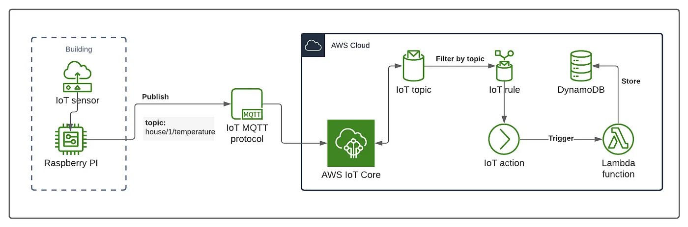

# Smart Home Health Monitoring System 🚀
 
[](https://aws.amazon.com/iot-core/)  
[](https://mqtt.org/)

A real‑time IoT solution using an ESP8266 and a DHT11 sensor to monitor temperature and humidity, transmitting data securely to AWS for storage and analysis.

---

## 📋 Table of Contents

1. [Features](#-features)  
2. [Hardware Requirements](#-hardware-requirements)  
3. [Software Requirements](#-software-requirements)  
4. [Wiring Diagram](#-wiring-diagram)  
5. [Project Structure](#-project-structure)  
---

## 🎯 Features

- **Real‑Time Data**: Continuous monitoring of temperature & humidity.  
- **Secure Transmission**: MQTT over TLS to AWS IoT Core.  
- **Serverless Processing**: AWS Lambda functions for data ingestion.  
- **Scalable Storage**: Time‑series data in Amazon DynamoDB.  
- **Modular Design**: Easy to extend with additional sensors or services.

---

## 🛠 Hardware Requirements

| Component             | Description                   |
|-----------------------|-------------------------------|
| **ESP8266 (NodeMCU)** | Wi‑Fi microcontroller module  |
| **DHT11 Sensor**      | Temperature & humidity sensor |
| Breadboard & Wires    | Prototyping hardware          |
| USB Cable             | Power & serial communication  |

---

## 💻 Software Requirements

- **Arduino IDE** (v1.8+)
- **Arduino Libraries**:  
  - `PubSubClient` (MQTT)  
  - `DHT sensor library`  
  - `Adafruit Unified Sensor`
- **AWS Account** with permissions for IoT Core, Lambda, DynamoDB
- **AWS CLI** (optional, for certificate management)

---

## 🔌 Wiring Diagram

```plaintext
DHT11 VCC   → 3.3V on ESP8266
DHT11 GND   → GND on ESP8266
DHT11 DATA  → D2 (GPIO4)
```

  ## 📷 Architecture

  


## 📂 Project Structure

 ```plaintext smart-home-health-system/ 
 ├── README.md              # Project documentation 
 ├── architecture.png       # System architecture diagram 
 ├── IoT_Cloud project.pdf  # Detailed project write-up 
 └── src/                   # Source code 
  └── cloud_iot_code.ino    # Main Arduino sketch 
 ``` 
